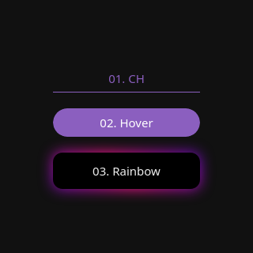

# CSS Buttons

A collection of some CSS buttons. SCSS files included.

## Preview

**[View Live Preview](https://css-buttons-rolodoom.netlify.app/)**

## Status

## Buttons

- Button 01 - Carolina Herrera page style
- Button 02 - Hover Effect [from CodePen](https://codepen.io/alticreation/pen/zBZwOP)
- Button 03 - Magic Button [from @midudev](https://www.tiktok.com/@midudev/video/7168490248937229573)

## Bugs and Issues

Have a bug or an issue with this template? [Open a new issue](https://github.com/rolodoom/css-buttons/issues) here on GitHub.

## License

This code in this repository is released under the [MIT](https://raw.githubusercontent.com/rolodoom/css-buttons/master/LICENSE) license, which means you can use it for any purpose, even for commercial projects. In other words, do what you want with it. The only requirement with the MIT License is that the license and copyright notice must be provided with the software.
